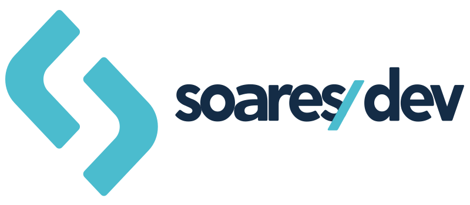
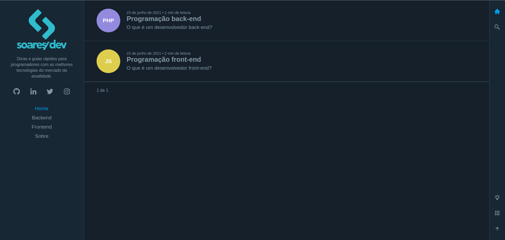
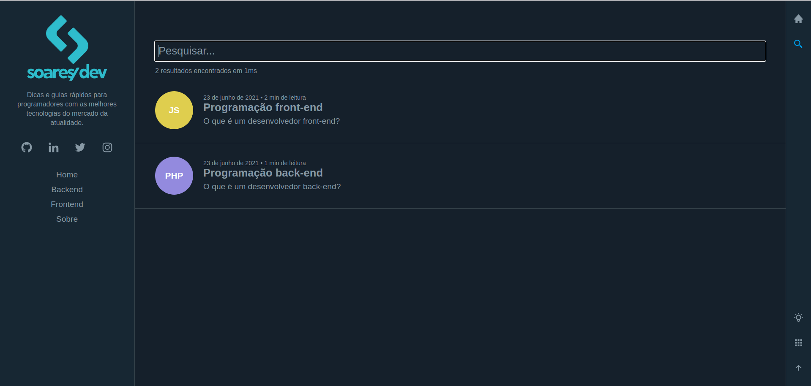
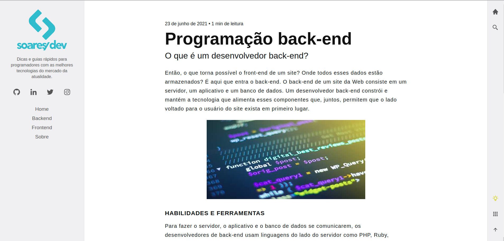
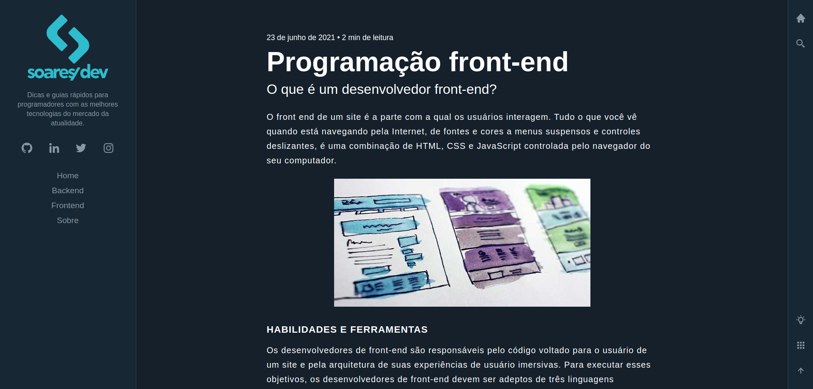
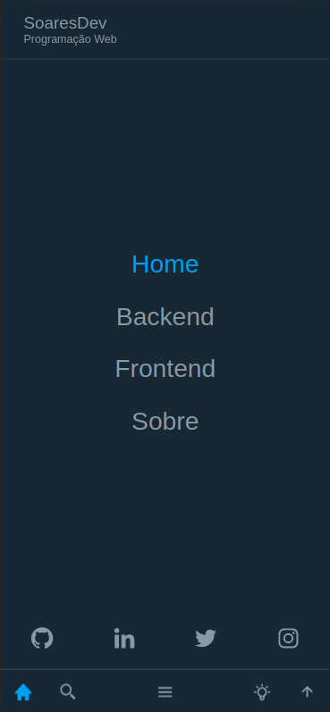
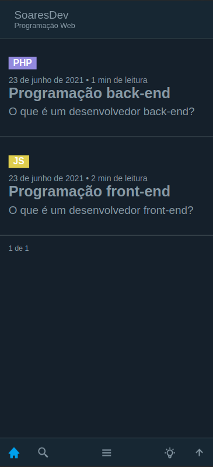
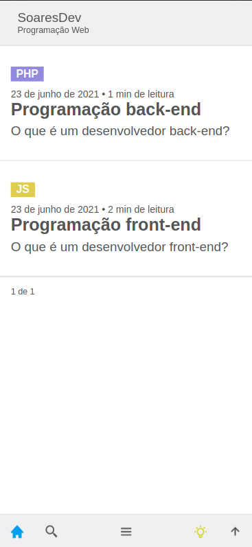

<h2 align="center">
  
</h2>

<p align="center">
  

  

  

  

  
</p>

##### :memo: About

SoaresDev Blog is a personal project I developed using the React framework Gatsby.js. Technologies and practices include GraphQL for efficient data queries, Markdown file integration for posts, Netlify CMS integration for content management, Google Analytics integration for site performance monitoring and analysis, SEO techniques resulting in a perfect 100 Google Lighthouse score. The blog features posts on technology and programming, aimed at helping and inspiring other developers.

##### :rocket: Main Technologies

<ul>
  <li><a target="_blank" href="https://devdocs.io/javascript/">Javascript</a></li>

  <li><a target="_blank" href="https://www.gatsbyjs.com/">GatsbyJS</a></li>

  <li><a target="_blank" href="https://graphql.org/">GraphQL</a></li>

  <li><a target="_blank" href="https://www.algolia.com/">Algolia</a></li>

  <li><a target="_blank" href="https://prismjs.com/">PrismJS</a></li>

  <li><a target="_blank" href="https://styled-components.com/">Styled-components</a></li>

  <li><a target="_blank" href="https://www.netlifycms.org/">Netlyfy CMS</a></li>
</ul>

##### :cyclone: Run locally

```bash
# Clone este repositório
$ git clone https://github.com/jefferson1104/blog-soaresdev.git

# Acesse a paste do projeto
$ cd blog-soaresdev

# Instale as dependencias do projeto utilizando o gerenciador de pacotes yarn
$ yarn

# Execute uma build do projeto localmente
$ gatsby build

# Após executar a build abra o projeto localmente http://localhost:9000
$ gatsby serve

# Ou execute o projeto localmente http://localhost:8000
$ gatsby develop

```

##### 🎨 Screenshots

<p align="center">
  
  
  
  
</p>

<p align="center">
  
  
  
  
</p>
