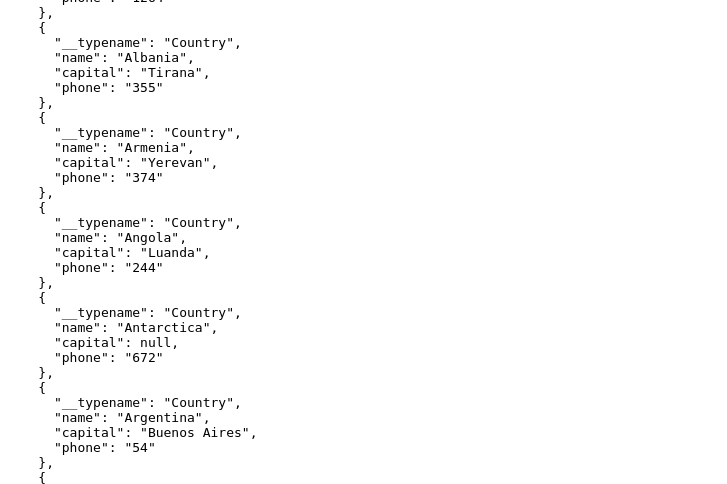
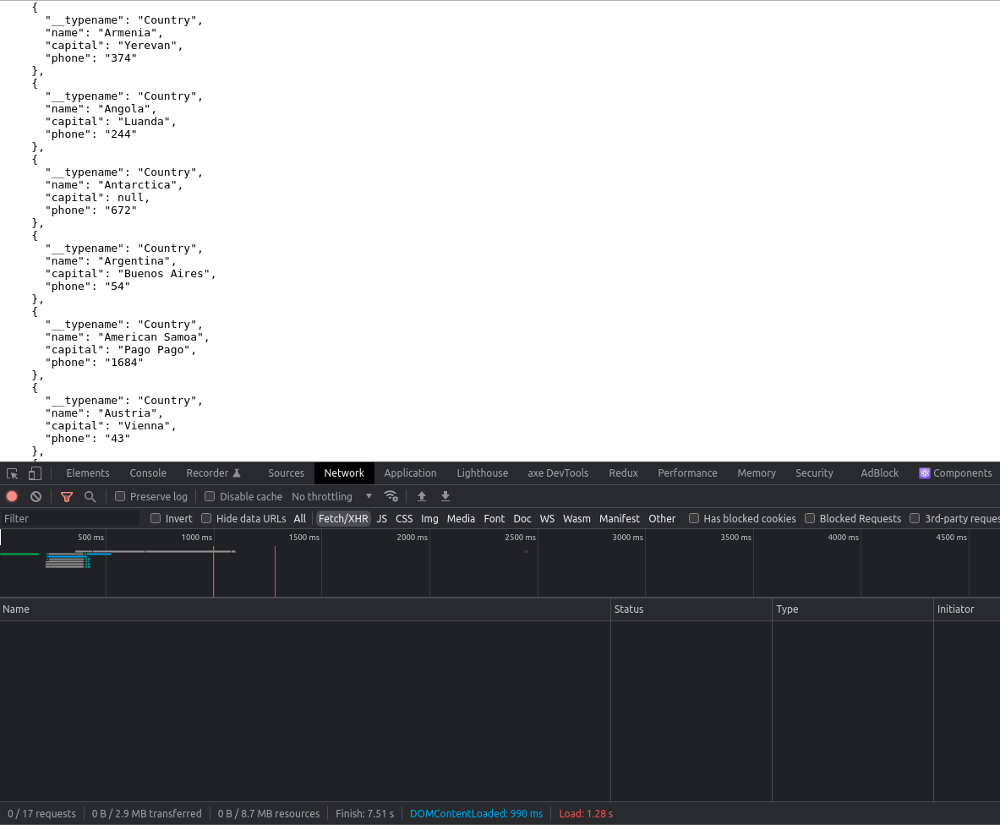

# APOLLO CLIENT (REACTJS/NEXTJS)
Para iniciar esse guia, você pode usar nosso [projeto como exemplo](https://github.com/jefferson1104/nextjs-graphql-apollo), aplicar em seu projeto atual ou criar do zero um projeto Next.js, neste tutorial eu criei um projeto utilizando o template do typescript, caso for criar do zero execute o comando:

```bash
$ yarn create next-app --typescript
```

## instalando apollo/client e graphql
```bash
$ yarn add @apollo/client graphql
```

## criando client e criando uma query
O "**ApolloClient**" é o responsável pela conexão com a API, o "**InMemoryCache**" é um ótimo recurso do apollo que permite que ele faça um cache dos dados que já foram capturados através de uma primeira requisição no servidor, trazendo um performance melhor. O "**gql**" server para fazer um parser da sua query do graphql.

ARQUIVO: **src/pages/index.tsx**
```typescript
import { ApolloClient, gql, InMemoryCache } from '@apollo/client'

export default function Index() {
  // instanciando o client
  const client = new ApolloClient({
    uri: 'https://countries.trevorblades.com',
    cache: new InMemoryCache()
  })

  // fazendo uma query
  client.query({
    query: gql`
      query GetCountries {
        countries {
          name
          capital
          phone
        }
      }
    `
  })

  return <h1>Home Page</h1>
}

```

> Resultado da requisição, você pode confirmar através da aba network no chrome developer tools


## criando o ApolloProvider e utilizando o hook useQuery
Toda vez que precisamos realizar uma query necessáriamente temos que ter instânciado um client, com isto iriamos ter que duplicar códigos, para que isso fique mais limpo e evitar essa repetição de códigos usamos o "**ApolloProvider**", ele é bem semelhante ao **React ContextProvider**.

É recomendado pela documentação do apollo que você utilize esse provider na parte mais externa da sua aplicação, no caso como estamos em um projeto **Next.js** com **typescript** vamos colocar esse Provider no nosso arquivo **"_app.tsx"**.

ARQUIVO: **src/pages/_app.tsx**
```typescript
import type { AppProps } from 'next/app'

import { ApolloClient, ApolloProvider, InMemoryCache } from '@apollo/client'

function App({ Component, pageProps }: AppProps) {
  // instanciando o client
  const client = new ApolloClient({
    uri: 'https://countries.trevorblades.com',
    cache: new InMemoryCache()
  })

  return (
    <ApolloProvider client={client}>
        <Component {...pageProps} />
    </ApolloProvider>
  )
}

export default App
```

Utilizando o **useQuery** e as propriedades que tem dentro dele em outra página.

Neste exemplo obtemos os dados (**data**), **loading** para veriricar enquanto os dados estão sendo carregados, e um **error** se caso venha a falhar a requisição na API.

ARQUIVO: **src/pages/index.tsx**
```typescript
import { gql, useQuery } from '@apollo/client'

export default function Index(props: HomeTemplateProps) {
  // utilizando o useQUery do apollo
  const { data, loading, error } = useQuery(gql`
    query GetCountries {
      countries {
        name
        capital
        phone
      }
    }
  `)

  if (loading) return <p>Loading...</p>

  if (error) return <p>{error}</p>

  if (data) return <pre>{JSON.stringify(data, null, 2)}</pre>

  return <h1>Home Page</h1>
}
```

RESULTADO:


## configuração base do Apollo para trabalhar com SSR/SSG no Next.js
Para iniciar nossa configuração vamos criar um arquivo a parte para o apollo, no exemplo a seguir criamos um diretório com nome de "**utils**" e dentro dele o arquivo "**apollo.ts**"

ARQUIVO: **src/utils/apollo.ts**
```typescript
import { useMemo } from 'react'
import {
  ApolloClient,
  HttpLink,
  InMemoryCache,
  NormalizedCacheObject
} from '@apollo/client'

let apolloClient: ApolloClient<NormalizedCacheObject>

function createApolloClient() {
  return new ApolloClient({
    ssrMode: typeof window === 'undefined',
    link: new HttpLink({ uri: 'https://countries.trevorblades.com' }),
    cache: new InMemoryCache()
  })
}

export function initializeApollo(initialState = {}) {
  // serve para verificar se já existe uma instância, para não criar outra.
  const apolloClientGlobal = apolloClient ?? createApolloClient()

  // se ja existe um estado inicial ele restaura para dentro do global (recupera os dados de cache)
  if (initialState) {
    apolloClientGlobal.cache.restore(initialState)
  }

  // se estiver no ssr retornar o apolloClientGlobal direto (sempre inicializando no SSR com cache limpo)
  if (typeof window === 'undefined') return apolloClientGlobal

  // se não estiver no SSR verifica e pega o apolloClient que tinha antes ou o apolloClientGlobal
  apolloClient = apolloClient ?? apolloClientGlobal

  // por fim retorna o objeto do apolloClient
  return apolloClient
}

// utilizano um memorize para caso o initialState nao mudar nao ficar reinicializando
export function useApollo(initialState = {}) {
  const store = useMemo(() => initializeApollo(initialState), [initialState])
  return store
}
```

- **ssrMode**: na maneira que colocamos retorna true, serve para saber se vamos usar no client ou no server side.

- **Link**: utilizando Link no lugar do **uri** serve para trabalhar com links isomórficos, no caso utilizar schema no lado do servidor e com a API client no lado do client, com esse link ele consegue pegar um ou outro.


## utilizando o Apollo no getServerSideProps (SSR)
Com a configuração base feita, vamos modificar alguns arquivos, o primeiro é o nosso **"_app.tsx"**

ARQUIVO: **src/pages/_app.tsx**
```typescript
import type { AppProps } from 'next/app'

import { ApolloProvider } from '@apollo/client'
import { useApollo } from '../utils/apollo'

function App({ Component, pageProps }: AppProps) {
  // instanciando o client, com initialState para cache
  const client = useApollo(pageProps.initialApolloState)

  return (
    <ApolloProvider client={client}>
        <Component {...pageProps} />
    </ApolloProvider>
  )
}

export default App
```

Agora vamos ver como fazer a chamada dos dados via server side rendering, modifique o seu arquivo index.tsx como o exemplo abaixo:

ARQUIVO: **src/pages/index.tsx**
```typescript
import {gql} from '@apollo/client'
import {initializeApollo} from '../utils/apollo'

const GET_COUNTRIES = gql`
  query getGames {
    games {
      name
    }
  }
`

export default function Index(props: any) {
  if (data) return <pre>{JSON.stringify(data, null, 2)}</pre>

  return <h1>Home Page</h1>
}

// getStaticProps => gerar estático em build time
// getServerSideprops => gerar via ssr a cada request (nunca vai para o bundle do client)
// getInitialProps => gerar via ssr a cada request (vai para o client, faz o hydrate do lado do cliente depois do primeiro request)
export async function getServerSideProps() {
  const apolloClient = initializeApollo()

  const { data } = await apolloClient.query({ query: GET_COUNTRIES })

  return {
    props: {
      data: data,
      initialApolloState: apolloClient.cache.extract(),
    }
  }
}
```

Desta forma trabalhamos com o Apollo no SSR, e o request dos dados na API é feita do lado do servidor e não do client, melhorando assim o SEO do site, resultado abaixo são os dados vindos da api sem um fetch do lado do client (browser)

